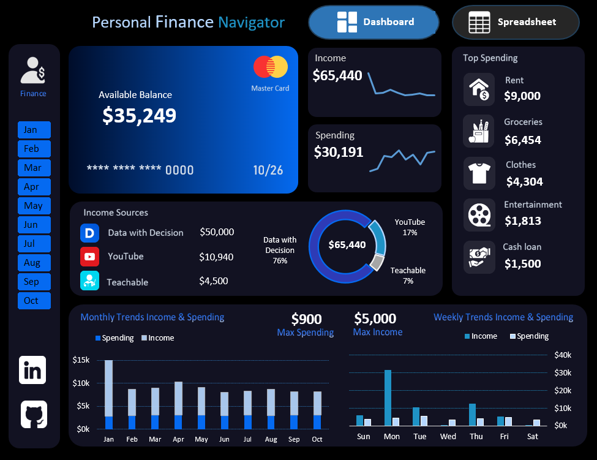

#  Personal Finance Navigator

An interactive **Personal Finance Navigator** built using Microsoft Excel to organize, analyze, and visualize personal financial transactions. The project transforms raw transaction data into meaningful financial insights through structured data analysis and an interactive dashboard.

---

##  Problem Statement

Managing personal financial transactions in raw data can make it difficult to understand spending behavior, income patterns, and overall financial performance.

The objective of this project is to develop an Excel-based financial dashboard that helps users:

- Track income and expenses
- Monitor overall financial balance
- Analyze spending across different categories
- Understand monthly and weekly financial trends
- Identify major sources of income and spending
- Explore financial data interactively

---

## ️ Tools & Features Used

### Tools

- Microsoft Excel

### Excel Features

- Excel Tables
- Formulas & Calculated Fields
- Pivot Tables
- Pivot Charts
- Slicers
- Conditional Formatting
- KPI Cards
- Data Visualization

---

##  Project Steps

### 1.  Data Cleaning & Preparation

- Structured the raw transaction data into an organized dataset.
- Standardized the financial data for analysis.
- Added helper fields such as **Month, Month Number, Week Day, and Net Amount**.
- Organized transactions into relevant categories and sub-categories.
- Prepared the dataset for PivotTable-based analysis.

### 2.  Data Analysis

The prepared data was analyzed to understand different aspects of personal finances, including:

- Total income
- Total expenses
- Net balance
- Income sources
- Category-wise spending
- Monthly income and expense trends
- Weekly income and expense patterns
- Debit and credit analysis

PivotTables and calculations were used to summarize the transaction-level data and generate the metrics required for the dashboard.

### 3.  Dashboard Design

An interactive dashboard was developed to present the analyzed information in a simple and easy-to-understand format.

The dashboard includes:

- Income KPI
- Expense KPI
- Balance KPI
- Income source analysis
- Spending category analysis
- Monthly trends
- Weekly trends
- Debit and credit analysis
- Interactive filters/slicers

The dashboard layout was designed to keep important financial information visible at a glance while allowing users to explore the data through interactive elements.

---

##  Dashboard Preview

---

##  Conclusion

Personal Finance Navigator demonstrates how Microsoft Excel can be used to transform raw financial transaction data into an interactive analytical dashboard.

The project combines **data preparation, data analysis, calculations, PivotTables, and data visualization** to provide a clear view of personal financial activity and make financial patterns easier to understand.

---
